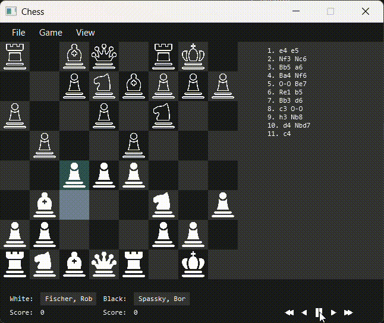

# blainos-chess
Chess app for PC made using JavaFX
Personal project by Blaine Jones for learning object-oriented programming and GUI design. 

## Capabilities
Two player local game of chess, with all rules of standard chess implemented and enforced, including:
- En passant
- Pawn promotion
- Check and checkmate conditions

The legality of moves are checked, and an illegal move is not allowed.

Captured pieces are shown on the side.

Moves are recorded in a sidebar in standard notation.

Games can be saved using the PGN file format. Games in PGN format can be loaded in.
Below is an example, with the loaded PGN file of the 29th game of the 1992 match played in Yugoslavia between Bobby Fischer and Boris Spassky:

Play/Fast Forward/Rewind buttons allow for loaded games to be "replayed", move by move. Technically can also act as undo button. Might be buggy.

## Explaining It All
### Chess.java
This is the main window, which loads in the chess board, the sidebar, the bottom bar, and the top menu bar, and handles loading games, saving games, flipping the board, etc.

Structurally, a lot of stuff in Chess.java outgrew the scope of this single file, and probably should've been split into other files. 

### ChessBoard.java
The board itself, as a class, is an extension of JavaFX's GridPane class. This works pretty well, since a chessboard is a grid, so building the chess logic on top of JavaFX's pre-existing graphical grid logic worked pretty well. 

A lot of the overarching game logic, including turn handling, is done here. 

Messiest part of this file is the readMove method, which takes an input move as a String written in standard Chess notation (used for when reading PGN files) and applies the given move. This was a later addition and you can kinda tell. 

### Pc.java 
This is an enum file for the pieces (KING, QUEEN, BISHOP, KNIGHT, ROOK, PAWN)

### Piece.java
The Piece class is an extension of the JavaFX ImageView class. Similar to ChessBoard in this way, building the Chess logic on top of a pre-existing JavaFX class which handles the graphical side. The ImageView takes an Image (in this cases, a given icon for a piece). These ImageView objects are moved from one StackPane (see Tile.java) to another, and this is how the Pieces are moved. In other words, a move is essentially a Piece being "popped" off one stack and "pushed" onto another. 

In this class, all the move logic is stored for every piece type. This is where edge cases are handled (pawns have lots of them, see booleans like enPassantVulnerable and promotePiece, and so do kings, see inCheck... also castled).

### Tile.java
The Tile class is an extension of the JavaFX StackPane class. Similar to ChessBoard and Piece classes above, building Chess logic on top of pre-existing JavaFX graphical classes. In this case, each Tile class is a StackPane (a stack data structure in which different graphical elements can be stacked on top of each other) with a rectangle at the bottom of the stack, colored either black or white (to form the checkerboard). Pieces are then "popped" from and "pushed" onto the stack, sitting on top of these rectangles. These Tile objects are arranged on the ChessBoard's grid structure to form the board itself. Each tile has a coordinate (rank and file, in Chess jargon), which is used to move pieces accordingly. 

Click logic is handled here, these are what the players click to select pieces and then select their movement destination. 

## Future Plans?
Honestly wouldn't be that difficult (famous last words) to implement remote multiplayer. All that would need to be sent across the socket for each move would be the move message, represented in simple move notation (e.g. "Qg5"). The board state, by this logic, would be easy to maintain. 

